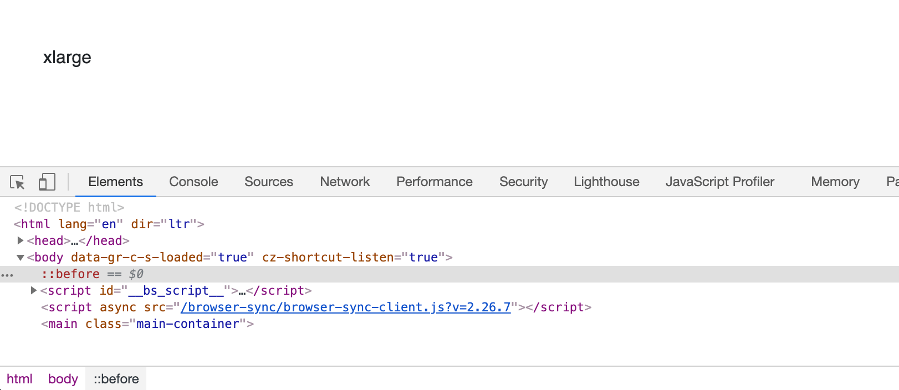
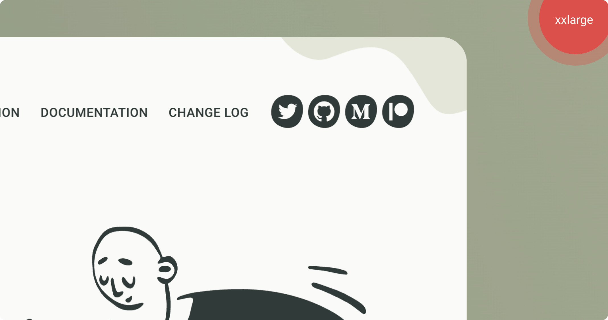

# Breakpointer



**Breakpointer Sass mixin** is a handy small tool that points which breakpoint you are at so that you can write your styles for that specific screen size. 


This mixin has been applied to this very page only, to show you how **Breakpointer Sass mixin** works. You can see the result at the top right corner of your screen. **Please, resize the width of your browser to see which breakpoint you're at.**



**Tip:** This mixin works best with the predefined breakpoint values in the `_map-for-breakpoints.scss` file. Ok, let me put it this way. **If the breakpoint mixin is the knight, the breakpointer is its squire.**




## Arguments


    


## Examples


Call the mixin at the root level of your style sheet without passing any argument.

@include breakpointer;


//CSS Output
@media (min-width: 0) {
  body::before {
    content: "xsmall";
  }
}
@media (min-width: 576px) {
  body::before {
    content: "small";
  }
}
@media (min-width: 768px) {
  body::before {
    content: "medium";
  }
}
@media (min-width: 992px) {
  body::before {
    content: "large";
  }
}
@media (min-width: 1200px) {
  body::before {
    content: "xlarge";
  }
}

<figure class="highlight-figure">
  
</figure>



You can pass a CSS declaration block to customize the looking (as I did when I was developing the Gerillass' site itself).

@include breakpointer {
  position: fixed;
  top: 0;
  right: 0;
  color: white;
  padding: 5px 10px;
  z-index: 10;
}


You can change the appearance as you like. 

<figure class="highlight-figure">
  
</figure>




Well, good news! You can call the Breakpointer Sass mixin in a selector if you wish.

.element {
  @include breakpointer();
}



//CSS Output
@media (min-width: 0) {
  .element::before {
    content: "xsmall";
  }
}
@media (min-width: 576px) {
  .element::before {
    content: "small";
  }
}
@media (min-width: 768px) {
  .element::before {
    content: "medium";
  }
}
@media (min-width: 992px) {
  .element::before {
    content: "large";
  }
}
@media (min-width: 1200px) {
  .element::before {
    content: "xlarge";
  }
}





**Important:** This mixin is for development mode only. So don't forget to comment out or remove the code before going any further for the production.
